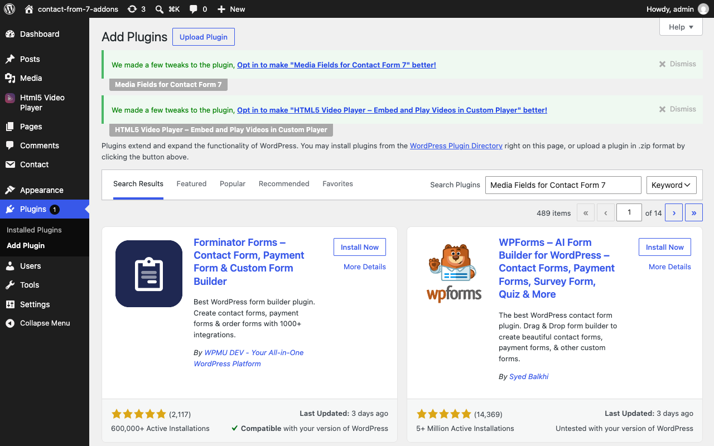
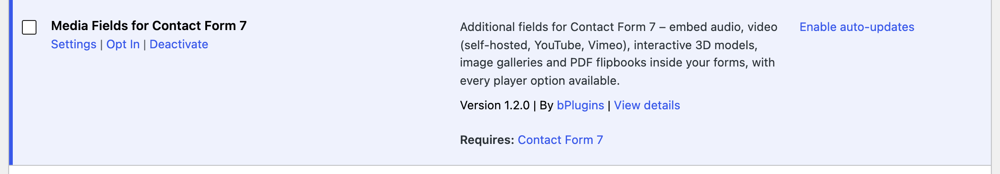
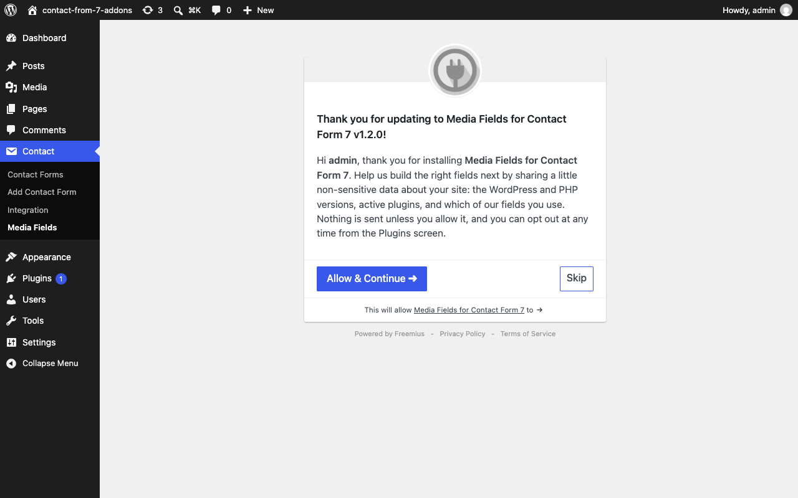
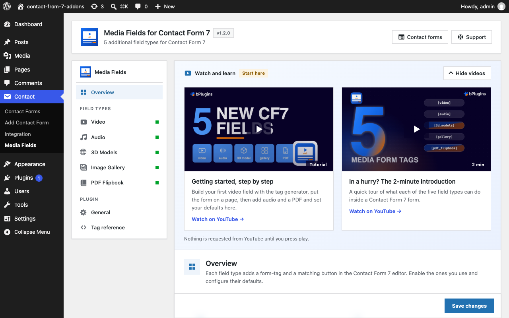
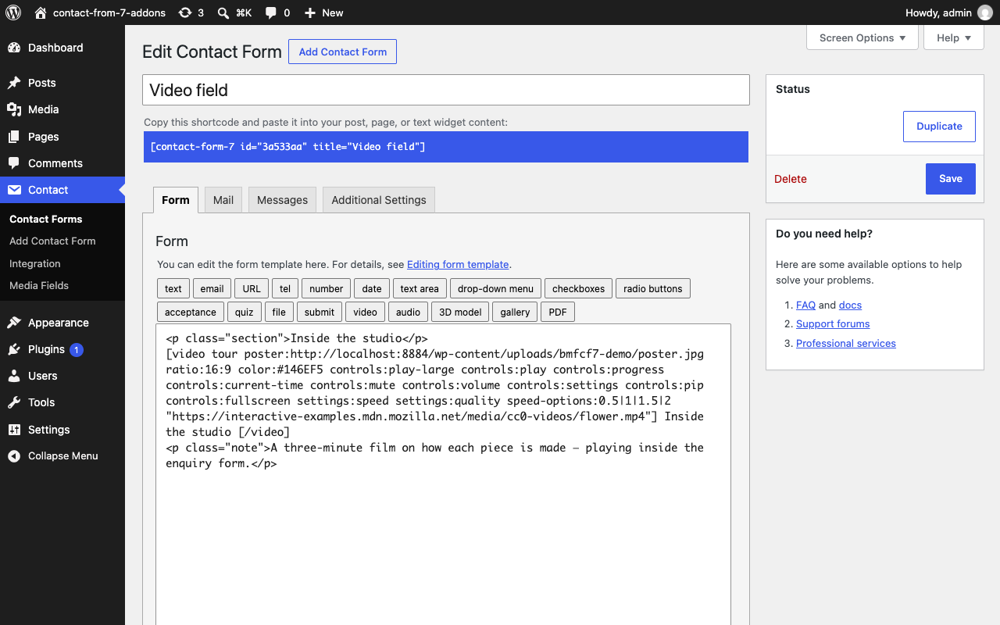
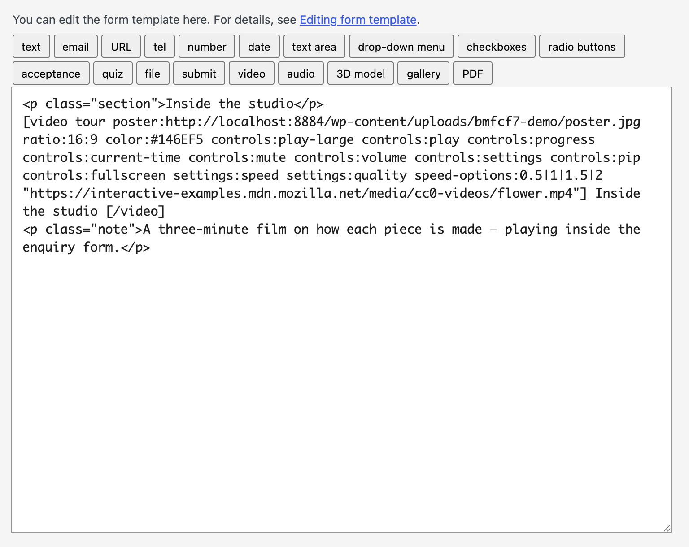
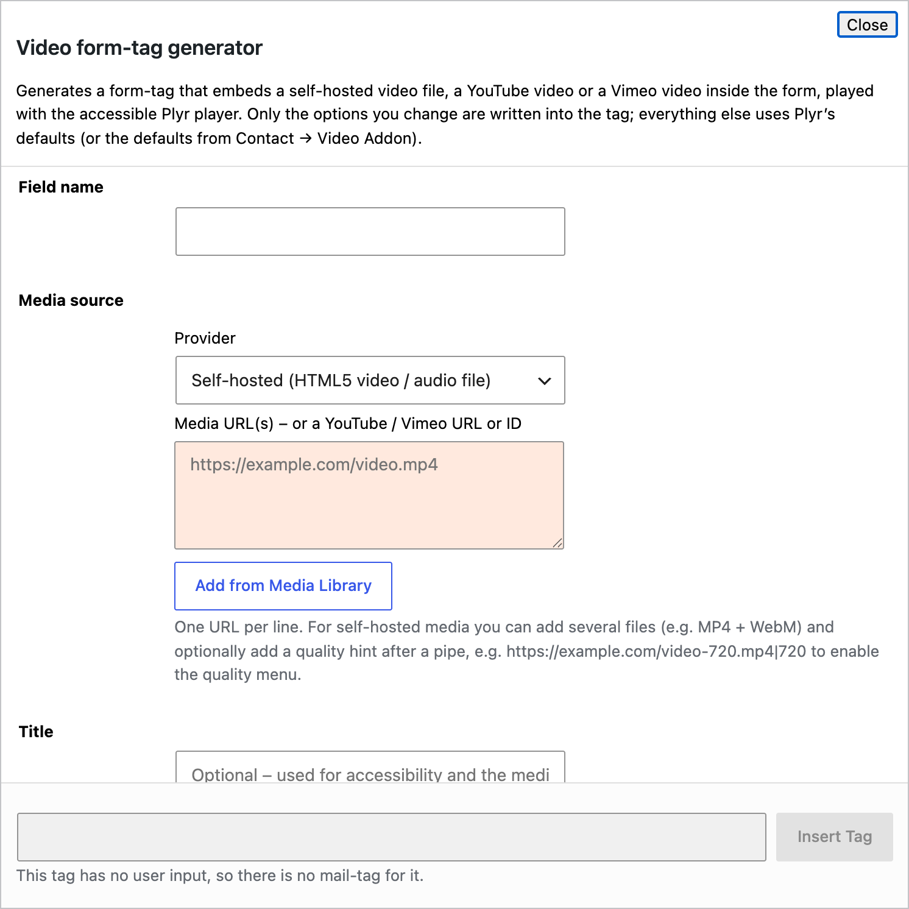
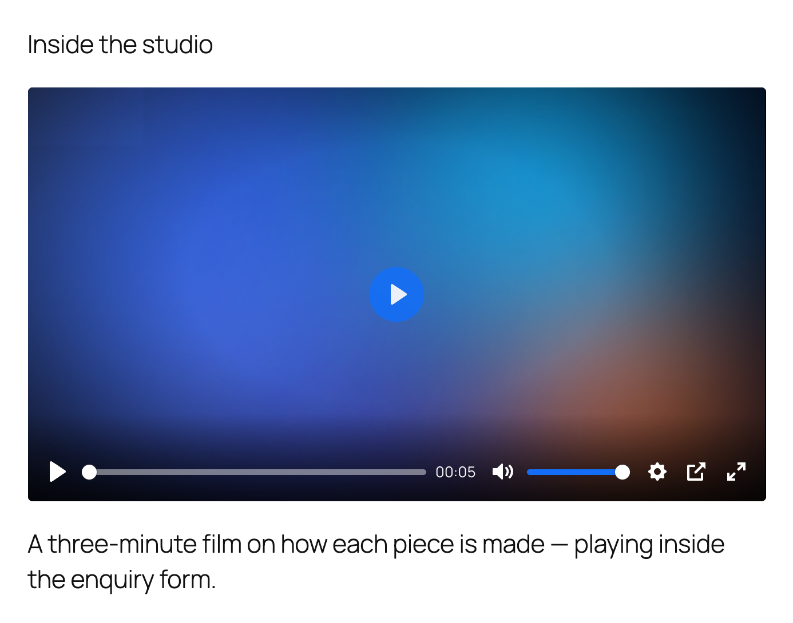

# 1. Getting started

This guide takes you from an empty site to a working video field inside a form. It takes about five minutes.

## 1.1 Install the plugin

In your WordPress admin go to **Plugins → Add New** and search for **Media Fields for Contact Form 7**. Click **Install Now**, then **Activate**.



If Contact Form 7 is not installed yet, WordPress asks you to install it first — the plugin needs it to work.

You can also upload the zip from the plugin page: **Plugins → Add New → Upload Plugin**.

## 1.2 Activate it

After activation the plugin appears in your plugin list with three links: **Settings**, **Opt In** and **Deactivate**.



## 1.3 The one-time opt-in

The first time you open the plugin you are asked, once, whether you would like to share some non-sensitive data about your site: the WordPress and PHP versions, the active plugins, and which of the media fields you use. It helps us decide which fields to build next.



* **Allow & Continue** — share the data.
* **Skip** — share nothing. The plugin works exactly the same.

Nothing is sent unless you allow it, and you can change your mind at any time from the **Opt In** / **Opt Out** link on the Plugins screen.

## 1.4 The dashboard

After that you land on the plugin's dashboard: **Contact → Media Fields**.



The dashboard has:

* **Watch and learn** — two short videos, a step-by-step tutorial and a two-minute introduction. Nothing is requested from YouTube until you press play. **Hide videos** collapses the panel and remembers your choice.
* **Overview** — a card for each field type with an on/off switch and a **Configure** button.
* The left menu — one page of defaults per field type, plus **General** and a **Tag reference** with copy-and-paste examples.

You do not need to change anything here to start. The defaults are sensible. Come back when you want to set a brand colour or a default layout for every form at once — see [Settings](07-settings.md).

## 1.5 Build your first field

Open a form: **Contact → Contact Forms**, then click a form or **Add New**.



Above the form editor is a row of tag buttons. The last five are the media fields: **video**, **audio**, **3D model**, **gallery** and **PDF**.



Click **video**. A tag generator opens.



1. **Field name** — type a short name, for example `intro`.
2. **Media source** — paste a video URL. This can be a file on your site, a YouTube link or a Vimeo link. **Add from Media Library** picks a file you have already uploaded.
3. **Title** — optional. Used for accessibility and shown on the lock screen on phones.
4. The sections below (Layout, Playback, Controls, and so on) are optional. Open any of them to change how the player looks or behaves. Only the options you change are written into the tag.
5. Click **Insert Tag**.

The tag appears in your form where the cursor was:

```
[video intro "https://example.com/intro.mp4"]
```

Put it wherever you want the player to appear — above the fields, between them, next to the submit button. Save the form.

## 1.6 Put the form on a page

Every Contact Form 7 form has a shortcode. It is at the top of the form editor:


Copy it and paste it into any page or post. In the block editor use a **Shortcode** block or the **Contact Form 7** block.

Open the page. The video plays inside the form:



## 1.7 What next

* Add the other fields the same way: [audio](03-audio.md), [3D models](04-3d-models.md), [galleries](05-gallery.md), [PDF flipbooks](06-pdf-flipbook.md).
* Set defaults once for every form in [Settings](07-settings.md).
* If something does not look right, see [FAQ and troubleshooting](08-faq.md).

> **Nothing is sent with the email.** Media fields display content; they do not collect anything. That is why they do not appear in the **Mail** tab and why the generator says "This tag has no user input, so there is no mail-tag for it."
