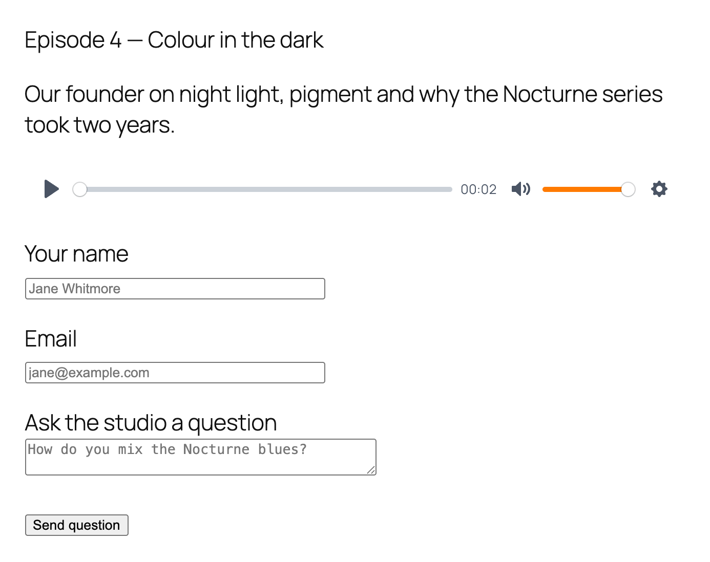
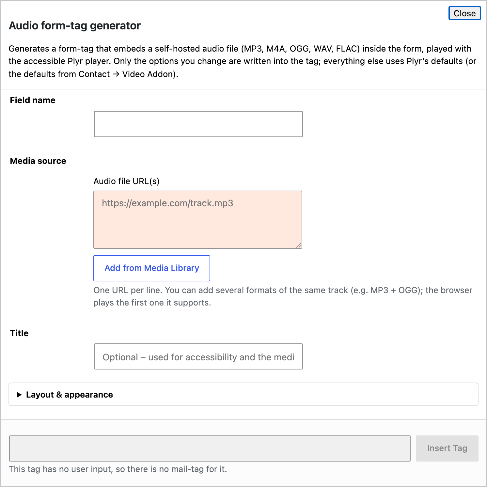

# 3. Audio field

Plays an audio file inside the form: MP3, M4A, AAC, OGG, WAV or FLAC. Good for a podcast episode above a question form, a voice message on a booking form, or a sample track on an order form.



## 3.1 Quick start with the generator

In the form editor click **audio**.



* **Field name** — required, for example `episode`.
* **Media URL(s)** — one URL per line. Add several formats if you have them; the browser picks one it can play. **Add from Media Library** picks an uploaded file.
* **Title** — optional. Shown on the lock screen on phones.

Click **Insert Tag**.

## 3.2 Examples

```
[audio episode "https://example.com/episode-4.mp3"]
```

With a title, artist name and brand colour:

```
[audio brief artist:Nocturne_Studio color:#FF7A00 "https://example.com/brief.mp3"] Episode 4 — Colour in the dark [/audio]
```

Two formats, so every browser can play it:

```
[audio jingle "https://example.com/jingle.mp3" "https://example.com/jingle.ogg"]
```

## 3.3 Options

The audio field uses the same player as the video field, so **every option in [Video → All options](02-video.md#24-all-options) also works here**. The ones that matter most for audio:

| Option | What it does |
|---|---|
| `color:` | Accent colour. |
| `width:` / `align:` | Size and alignment of the player. |
| `autoplay`, `muted`, `loop` | Playback flags. Autoplay needs muted. |
| `volume:` | Starting volume, 0–1. |
| `controls:` | Which buttons to show: `restart`, `rewind`, `play`, `fast-forward`, `progress`, `current-time`, `duration`, `mute`, `volume`, `settings`, `download`. |
| `settings:` | Gear menu items: `speed`, `loop`. |
| `speed:` / `speed-options:` | Playback speed and the speeds offered. |
| `artist:`, `album:`, `artwork:` | Lock-screen information on phones. Use `_` for spaces. |
| `download:` | File served by the Download button. |
| `no-storage` | Do not remember the visitor's volume and speed. |

Options that only make sense for pictures — `ratio:`, `poster:`, captions, fullscreen, picture-in-picture, YouTube and Vimeo options — are ignored.

## 3.4 Site-wide defaults

**Contact → Media Fields → Audio** sets the accent colour, the default controls, the settings menu and the behaviour switches for every audio player at once. See [Settings](07-settings.md).
