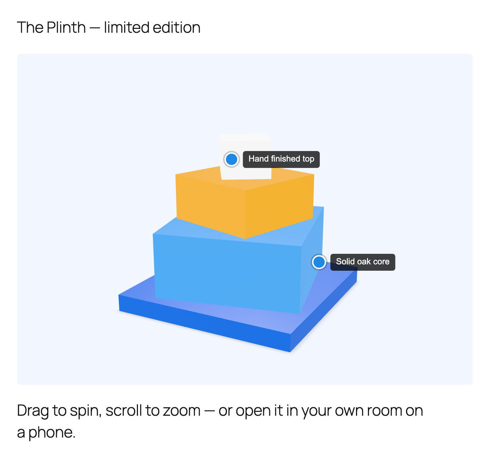
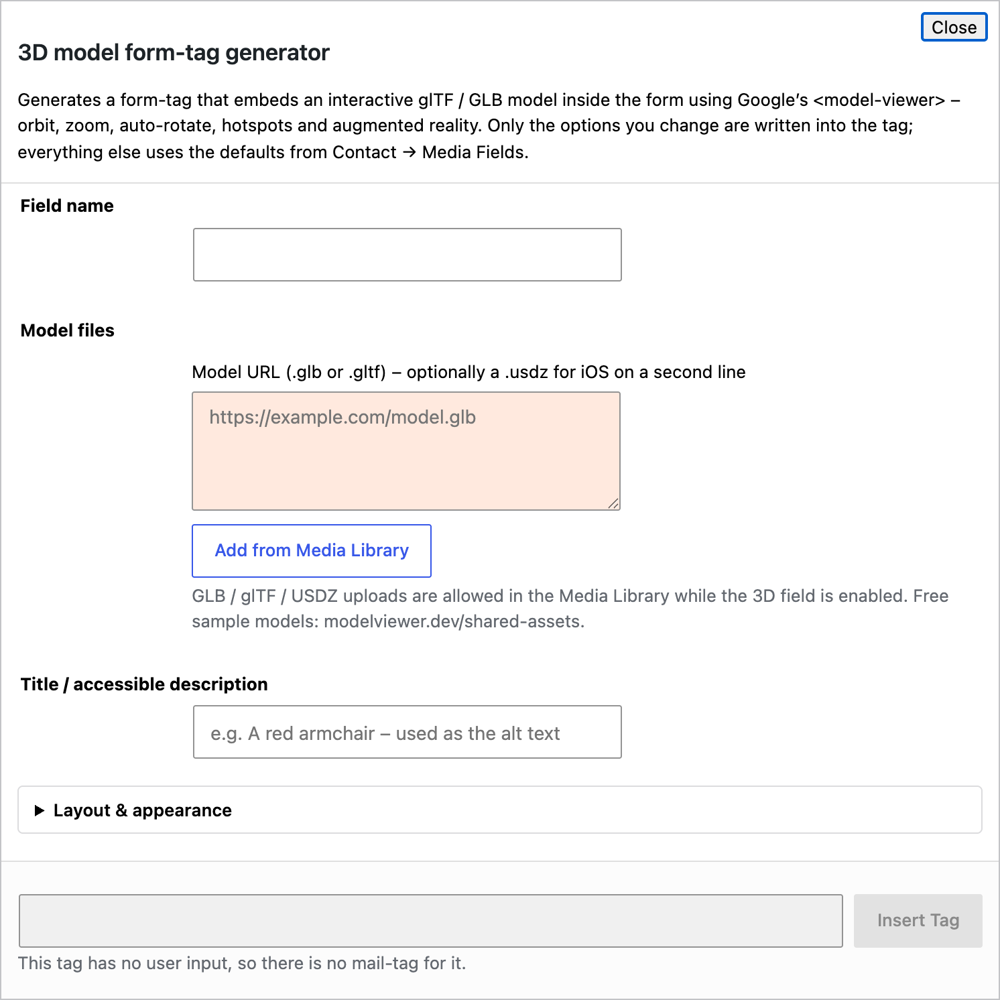

# 4. 3D model field

Shows an interactive 3D model inside the form. Visitors drag to spin it, scroll to zoom, and on a phone can place it in their own room with augmented reality. Useful for product enquiries, made-to-order items and anything people want to inspect before they ask.

The viewer is Google's [`<model-viewer>`](https://modelviewer.dev/), and every one of its options is available.



## 4.1 What you need

* A model in **glTF** or **GLB** format (`.glb` is a single file and the easiest to work with).
* Optionally a **USDZ** file of the same model for augmented reality on iPhones and iPads.

While the 3D field is enabled, the Media Library accepts `.glb`, `.gltf`, `.usdz` and `.hdr` uploads, so you can upload models like any other file. Free sample models to try: https://modelviewer.dev/shared-assets/.

## 4.2 Quick start with the generator

In the form editor click **3D model**.



* **Field name** — required, for example `product`.
* **Model URL** — the `.glb` or `.gltf` file. Put a `.usdz` file on a second line for iOS augmented reality. **Add from Media Library** picks an uploaded model.
* **Title / accessible description** — used as the alt text, for example "A red armchair".

The sections below (Layout, Camera, Augmented reality, Lighting, Animation, Hotspots) are optional. Click **Insert Tag**.

## 4.3 Examples

The simplest tag:

```
[3d_models product "https://example.com/chair.glb"]
```

Spinning slowly, with the AR button and an iOS file:

```
[3d_models chair auto-rotate ar "https://example.com/chair.glb" "https://example.com/chair.usdz"] Red armchair [/3d_models]
```

A product shot: soft shadow, studio lighting, a pale background, two labelled hotspots and a custom AR button:

```
[3d_models product auto-rotate ar camera-orbit:28deg|74deg|auto shadow-intensity:1 shadow-softness:0.6 environment:neutral exposure:1.15 height:470 bg:#F2F7FF hotspot:0|0.75|0.25|Hand_finished_top hotspot:0.75|-0.16|0|Solid_oak_core ar-button-label:View_in_your_room "https://example.com/plinth.glb"] The Plinth [/3d_models]
```

## 4.4 Rules worth knowing

* Values with several parts use `|`: `camera-orbit:0deg|75deg|105%` becomes `0deg 75deg 105%`.
* Lengths accept `m`, `cm`, `mm`, `deg`, `rad`, `%` or `auto`.
* Use `_` for a space in labels: `Hand_finished_top`.
* The first non-USDZ URL is the model; the first `.usdz` URL is used for iOS.

## 4.5 All options

### Layout and appearance

| Option | Values | What it does |
|---|---|---|
| `height:` | 100–2000 | Viewer height in px. Empty = the settings default (400). |
| `width:` | 100–4000 | Maximum width in px. |
| `align:` | `center`, `right` | Alignment. Empty = left. |
| `bg:` | hex | Background colour. Ignored when a skybox is set. |
| `poster-color:` | hex | Colour shown while loading. |
| `progress-color:` | hex | Colour of the loading bar. |
| `progress-height:` | 0–50 | Thickness of the loading bar. |
| `no-progress-bar` | flag | Hide the loading bar. |

### Loading

| Option | Values | What it does |
|---|---|---|
| `poster:` | image URL | Picture shown until the model has loaded. |
| `loading:` | `lazy`, `eager` | When to load. Empty = when it comes near the screen. |
| `reveal:` | `manual` | Keep the poster until the visitor interacts. |
| `with-credentials` | flag | Send cookies when fetching the model. |
| `generate-schema` | flag | Add 3DModel structured data for search engines. |

### Camera and interaction

| Option | Values | What it does |
|---|---|---|
| `no-camera-controls` | flag | Visitors cannot rotate or zoom. |
| `auto-rotate` | flag | Spin slowly. |
| `no-auto-rotate` | flag | Never spin, even if the settings default says so. |
| `auto-rotate-delay:` | ms | Idle time before spinning starts. |
| `rotation-per-second:` | e.g. `30deg` | Spin speed. |
| `camera-orbit:` | `theta\|phi\|radius`, default `0deg\|75deg\|105%` | Starting camera position. |
| `camera-target:` | `x\|y\|z` | Point the camera looks at. |
| `field-of-view:` | e.g. `30deg` | Zoom level. |
| `min-camera-orbit:` / `max-camera-orbit:` | `theta\|phi\|radius` | Limits of camera movement. |
| `min-field-of-view:` / `max-field-of-view:` | e.g. `10deg` | Zoom limits. |
| `disable-zoom` / `disable-pan` / `disable-tap` | flags | Turn off zooming, panning, tap-to-recentre. |
| `touch-action:` | `pan-y`, `pan-x`, `none` | `pan-y` lets phone users scroll the page over the model. |
| `orbit-sensitivity:` / `zoom-sensitivity:` / `pan-sensitivity:` | number | How fast each gesture moves. |
| `interaction-prompt:` | `none` | Hide the "drag to rotate" hint. |
| `interaction-prompt-style:` | `basic` | A simpler hint. |
| `interaction-prompt-threshold:` | ms | Delay before the hint. |
| `interpolation-decay:` | ≥1, default 50 | Camera smoothing. |

### Augmented reality

| Option | Values | What it does |
|---|---|---|
| `ar` | flag | Show the "View in your space" button. |
| `no-ar` | flag | Never show it, even if the settings default says so. |
| `ar-modes:` | `webxr`, `scene-viewer`, `quick-look`, separated by `\|` | AR methods in order of preference. Quick Look (iOS) needs a USDZ file. |
| `ar-scale:` | `fixed` | Stop visitors resizing the model in AR. |
| `ar-placement:` | `wall` | Place on a wall instead of the floor. |
| `ios-src:` | URL | The USDZ file, if not given as a second URL. |
| `usdz-max-texture-size:` | ≥16 | Texture size limit for auto-generated USDZ. |
| `xr-environment` | flag | Use real-world lighting in WebXR. |
| `ar-button-label:` | text | Label of the AR button. Use `_` for spaces. |

### Lighting and environment

| Option | Values | What it does |
|---|---|---|
| `environment:` | `neutral`, `legacy`, or an `.hdr`/`.jpg` URL | Lighting. `neutral` is even studio light. |
| `skybox:` | image URL | Background panorama. |
| `skybox-height:` | e.g. `1.5m` | Project the skybox onto the ground. |
| `exposure:` | ≥0, default 1 | Brightness. |
| `tone-mapping:` | `neutral`, `aces`, `agx`, `reinhard`, `cineon`, `linear`, `none` | Colour response. |
| `shadow-intensity:` | 0–1 | Strength of the ground shadow. |
| `shadow-softness:` | 0–1 | Blur of the ground shadow. |

### Animation and variants

| Option | Values | What it does |
|---|---|---|
| `animation:` | name | Which animation in the file to play. |
| `autoplay` | flag | Play it automatically. |
| `crossfade:` | ms | Blend time between animations. |
| `variant:` | name | Which material variant to show. |
| `orientation:` | `roll\|pitch\|yaw` | Rotate the model, e.g. `0deg\|0deg\|90deg`. |
| `scale:` | `x\|y\|z` | Scale the model, e.g. `0.5\|0.5\|0.5`. |
| `bounds:` | `tight`, `legacy` | How the model's size is measured. |

### Hotspots

A hotspot is a labelled dot pinned to a point on the model.

| Option | Values | What it does |
|---|---|---|
| `hotspot:` | `x\|y\|z\|Label`, one option per hotspot | Position in metres, label optional. Add `\|nx\|ny\|nz` for the surface direction if needed. |
| `min-hotspot-opacity:` | 0–1 | How visible a hotspot is when behind the model. |
| `max-hotspot-opacity:` | 0–1 | How visible when in front. |

```
[3d_models chair hotspot:0|0.5|0.2|Handle hotspot:-0.3|0.1|0|Base_plate "https://example.com/chair.glb"]
```

To find coordinates, open the model at https://modelviewer.dev/editor/, click the surface and read the position.

### Advanced

| Option | What it does |
|---|---|
| `seamless-poster` | Fade the poster into the rendered model. |
| `id:` / `class:` | Standard Contact Form 7 options. |

## 4.6 Site-wide defaults

**Contact → Media Fields → 3D Models** sets the default height, colours, camera controls, auto-rotate, the interaction prompt, AR, lighting, tone mapping, exposure, shadow and loading strategy. See [Settings](07-settings.md).
