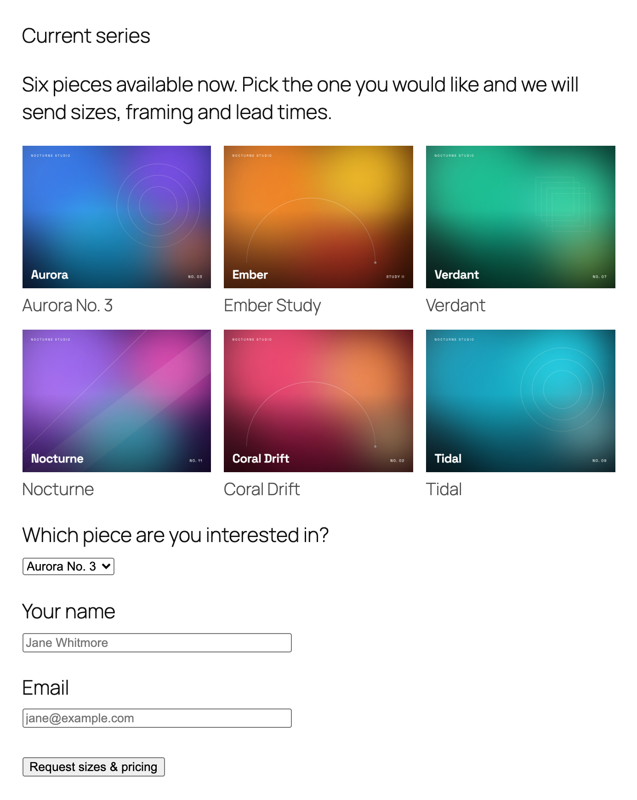
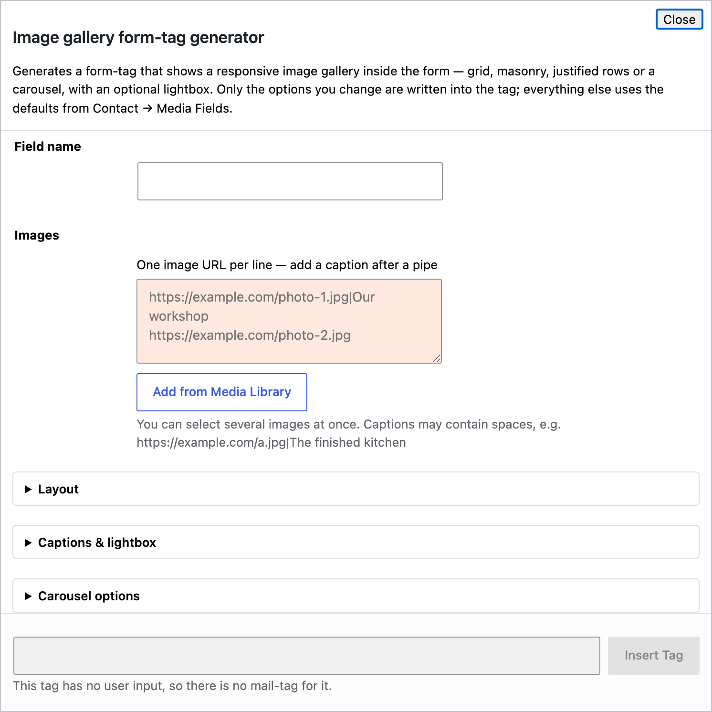
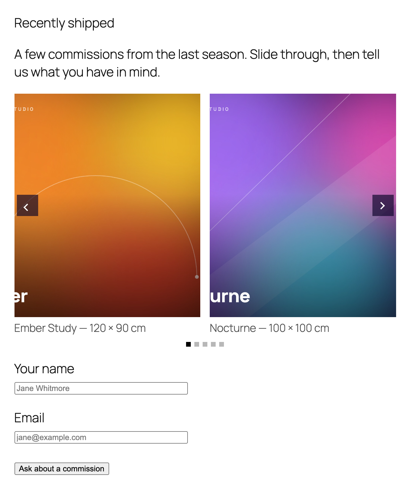
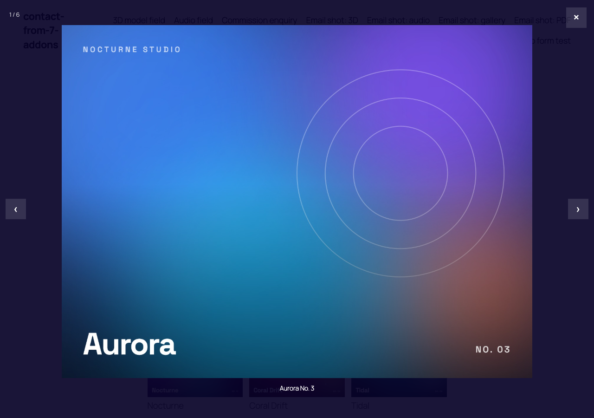

# 5. Image gallery field

Shows a set of images inside the form: as a grid, a masonry wall, justified rows or a carousel, with captions and a lightbox. Show recent work above an enquiry form, product photos above an order form, or room pictures above a booking form.



## 5.1 Quick start with the generator

In the form editor click **gallery**.



* **Field name** — required, for example `work`.
* **Images** — one URL per line. **Add from Media Library** lets you pick several images at once. To add a caption, put it after a pipe on the same line: `https://example.com/a.jpg|Aurora No. 3`.
* Open the **Layout** section to choose Grid, Masonry, Justified rows or Carousel, and **Captions & lightbox** / **Carousel options** for the rest.

Click **Insert Tag**.

## 5.2 Examples

A three-column grid with captions:

```
[gallery work columns:3 gap:14 ratio:4:3 captions "https://example.com/art-1.jpg|Aurora No. 3" "https://example.com/art-2.jpg|Ember Study" "https://example.com/art-3.jpg|Verdant"]
```

A carousel showing two slides at a time:

```
[gallery slides layout:carousel columns:2 height:378 gap:16 captions "https://example.com/a.jpg|Ember Study — 120 × 90 cm" "https://example.com/b.jpg|Nocturne — 100 × 100 cm"]
```



A carousel that advances on its own every five seconds:

```
[gallery portfolio layout:carousel autoplay interval:5 "https://example.com/a.jpg" "https://example.com/b.jpg"]
```

## 5.3 The lightbox

Clicking an image opens it full size with previous / next arrows and a counter. It is on by default; add `no-lightbox` to turn it off for one gallery, or switch it off for all galleries in Settings.



## 5.4 Rules worth knowing

* Captions are the one place **spaces are allowed**, because the whole value is in quotes. Everything after the first `|` is the caption.
* The caption is also used as the image's alt text.
* The gallery has no closing tag; text between `[gallery]` and `[/gallery]` is ignored.

## 5.5 All options

### Layout

| Option | Values | What it does |
|---|---|---|
| `layout:` | `masonry`, `carousel`, `justified` | Empty = grid (or the settings default). |
| `columns:` | 1–8 | Columns on desktop. Tablets get half, phones one. Default 3. |
| `gap:` | 0–80 | Space between images in px. Default 8. |
| `ratio:` | `1:1`, `4:3`, `3:2`, `16:9`, `3:4` | Thumbnail shape. Empty = the image's own shape. |
| `height:` | 80–900 | Row height for justified rows and carousels, in px. Default 240. |
| `width:` | 100–4000 | Maximum width of the gallery. |
| `align:` | `center`, `right` | Alignment. Empty = left. |
| `contain` | flag | Fit the whole image in the thumbnail instead of cropping. |

### Captions and lightbox

| Option | What it does |
|---|---|
| `captions` | Show captions under the images. |
| `no-lightbox` | Images are not clickable. |
| `no-counter` | Hide the "3 / 12" counter in the lightbox. |
| `eager` | Load every image straight away instead of as they scroll into view. |

### Carousel only

| Option | Values | What it does |
|---|---|---|
| `autoplay` | flag | Move to the next slide on its own. |
| `interval:` | 1–60 | Seconds between slides. |
| `no-arrows` | flag | Hide the previous / next arrows. |
| `no-dots` | flag | Hide the dots. |

### Advanced

| Option | What it does |
|---|---|
| `link-full` | Clicking opens the image file in a new tab instead of the lightbox. |
| `id:` / `class:` | Standard Contact Form 7 options. |

## 5.6 Site-wide defaults

**Contact → Media Fields → Image Gallery** sets the default layout, columns, gap, thumbnail ratio, row height, lightbox and captions. See [Settings](07-settings.md).

> Note: when **Show captions** is switched on in Settings it applies to every gallery; there is no per-gallery option to hide them again. Leave the setting off and add the `captions` flag to the galleries that need it.
