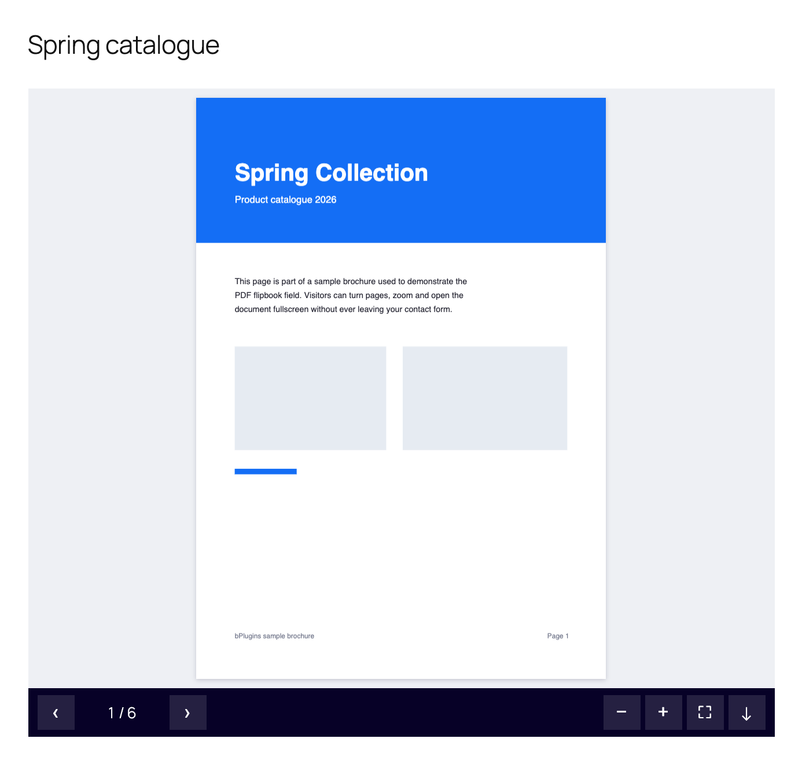
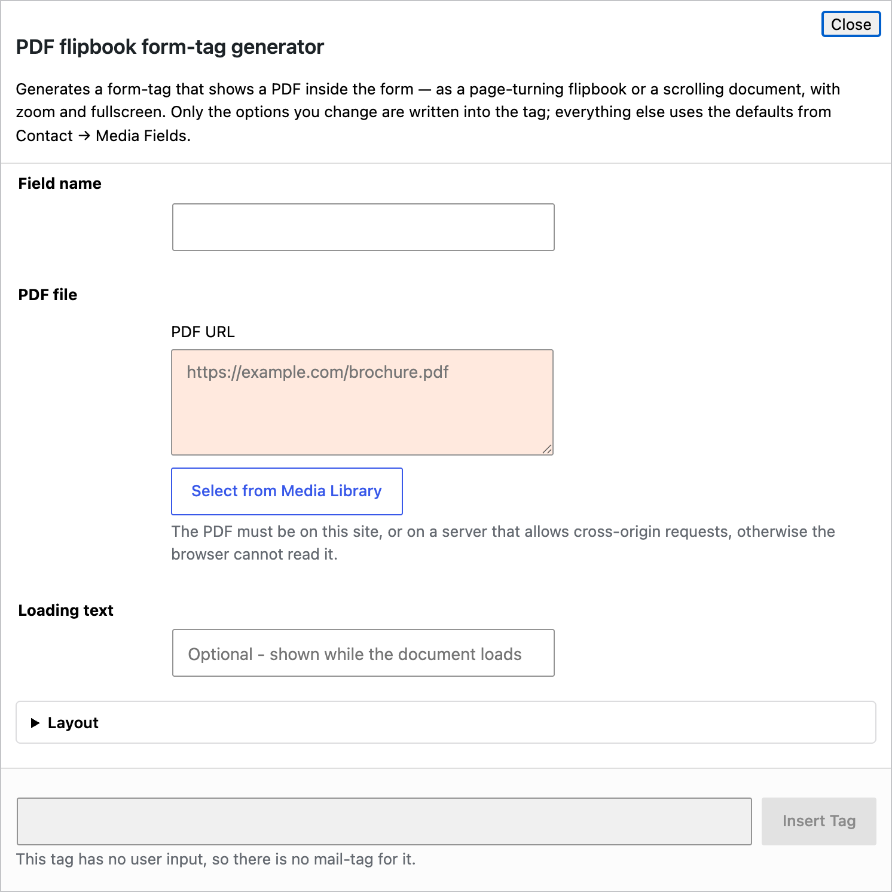

# 6. PDF flipbook field

Shows a PDF inside the form, either as a book whose pages turn, or as pages stacked one under the other. Visitors can zoom, go fullscreen and, if you allow it, download the file. Good for catalogues, brochures, price lists and menus that you want people to read *before* they fill in the form.



## 6.1 Quick start with the generator

In the form editor click **PDF**.



* **Field name** — required, for example `catalogue`.
* **PDF URL** — the file. **Select from Media Library** picks an uploaded PDF.
* **Loading text** — optional; shown while the document loads.
* Open the **Layout** and **Viewer** sections for size, Flipbook or Scroll mode, start page and the toolbar buttons.

Click **Insert Tag**.

## 6.2 Examples

```
[pdf_flipbook brochure "https://example.com/brochure.pdf"]
```

A taller viewer that loads straight away and allows download:

```
[pdf_flipbook catalogue height:560 eager download "https://example.com/catalogue.pdf"] Loading the catalogue… [/pdf_flipbook]
```

Scrolling pages, opening on page 3, no toolbar:

```
[pdf_flipbook terms mode:scroll start-page:3 no-toolbar "https://example.com/terms.pdf"]
```

## 6.3 Rules worth knowing

* Only the **first** URL is used.
* The PDF is loaded when it scrolls into view, so a long page with a flipbook near the bottom does not download the file until needed. Add `eager` to load it immediately.
* The **download button is hidden by default** so the document stays inside your page. Add `download` to show it.
* Large PDFs render page by page; the first page appears as soon as it is ready.

## 6.4 All options

### Layout

| Option | Values | What it does |
|---|---|---|
| `height:` | 200–2000 | Viewer height in px. Default 520. |
| `width:` | 200–4000 | Maximum width in px. |
| `align:` | `center`, `right` | Alignment. Empty = left. |
| `bg:` | hex | Background behind the pages. |

### Viewer

| Option | Values | What it does |
|---|---|---|
| `mode:` | `scroll` | Stacked pages. Empty = flipbook (or the settings default). |
| `start-page:` | 1–9999 | Page to open on. |
| `single-page` | flag | One page at a time, never a two-page spread. |
| `flip-time:` | 100–3000 | Page turn duration in ms. Default 800. |
| `no-shadow` | flag | No page-turn shadow. |
| `eager` | flag | Load immediately. |

### Toolbar

| Option | What it does |
|---|---|
| `no-toolbar` | Hide the whole toolbar. |
| `no-nav` | Hide previous / next and the page counter. |
| `no-zoom` | Hide zoom in / out. |
| `no-fullscreen` | Hide the fullscreen button. |
| `download` | Show a download button. |

### Advanced

| Option | What it does |
|---|---|
| `id:` / `class:` | Standard Contact Form 7 options. |

## 6.5 Site-wide defaults

**Contact → Media Fields → PDF Flipbook** sets the default height, background, mode, page-turn duration and whether the toolbar shows. See [Settings](07-settings.md).
