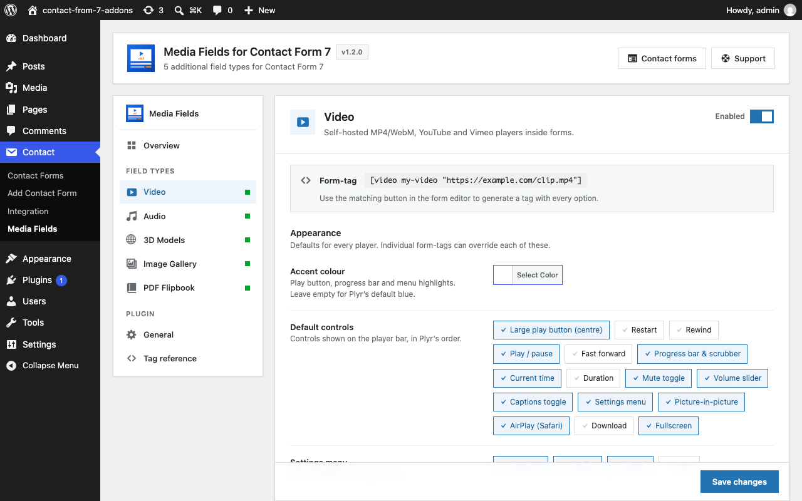
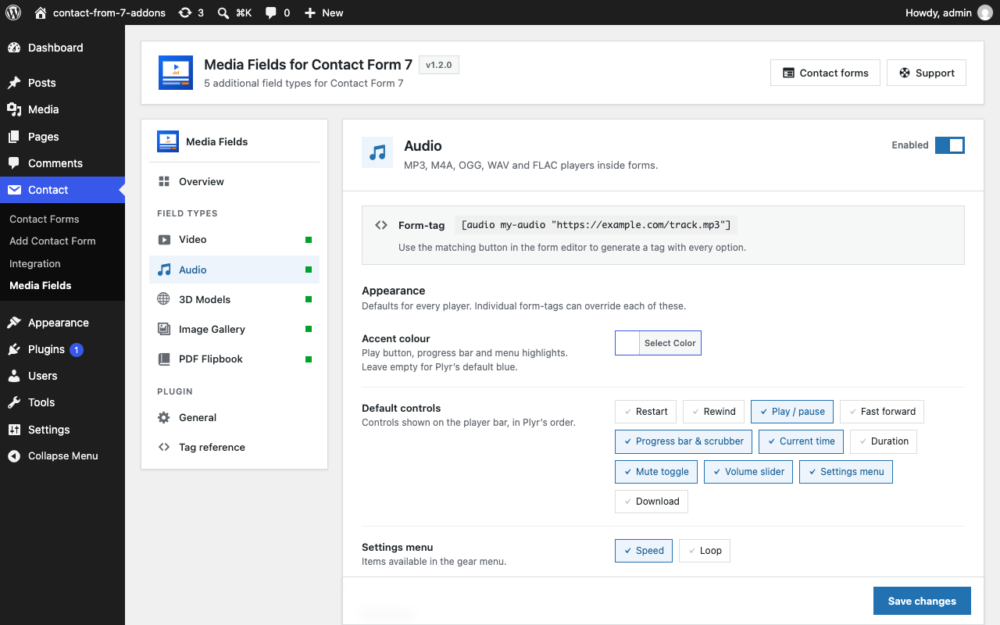
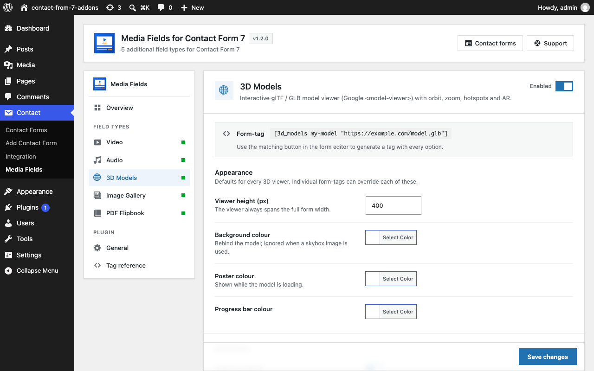
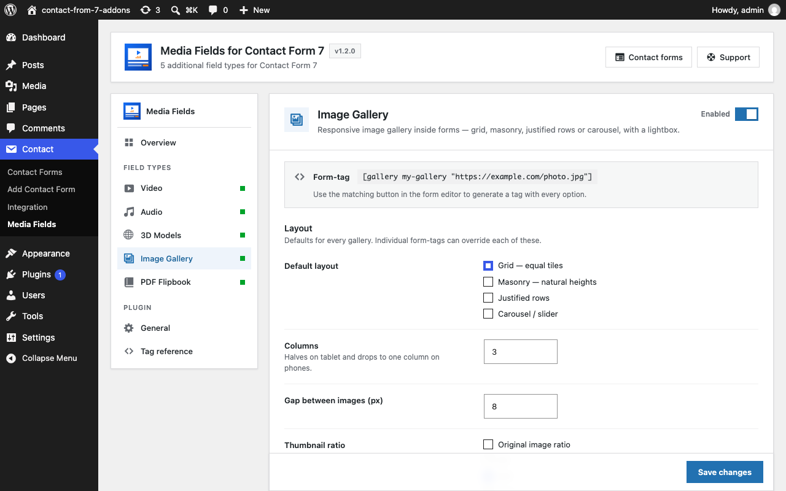
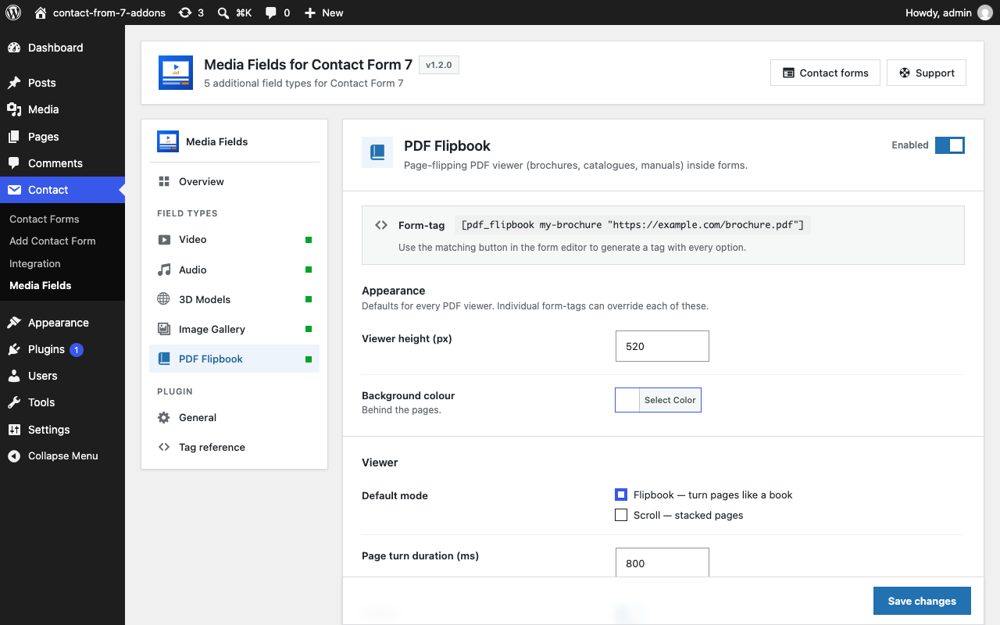
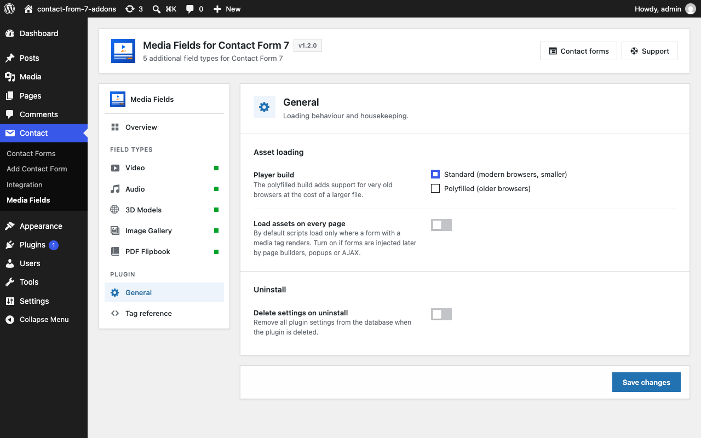
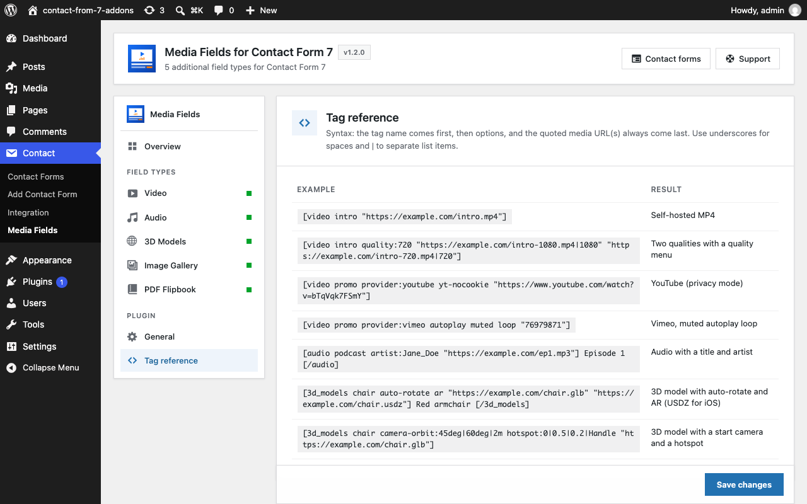

# 7. Settings

**Contact → Media Fields** holds the site-wide defaults. Set something here once and every form uses it; a tag option in one form always overrides the default for that form only.

## 7.1 Overview

The Overview page shows one card per field type. Each card has:

* an **on/off switch** — switch a field type off and its tags render nothing for visitors (editors see a small notice in the form editor instead), and its assets are no longer loaded;
* a **Configure** button that jumps to that field's defaults.

Below the cards, **Watch and learn** holds the two tutorial videos. **Hide videos** collapses the panel; the choice is remembered per user.

Click **Save changes** after any change. An unsaved-changes hint appears next to the button when something differs from what is stored.

## 7.2 Video

| Setting | Default | What it does |
|---|---|---|
| Accent colour | Plyr blue | Colour of the controls in every video player. |
| Default controls | large play, play, progress, current time, mute, volume, captions, settings, PiP, AirPlay, fullscreen | Buttons shown when a tag does not set `controls:`. |
| Settings menu | captions, quality, speed | Items in the gear menu when a tag does not set `settings:`. |
| Remember visitor preferences | on | Remember volume, speed and captions in the visitor's browser. |
| Auto-hide controls | on | Hide the controls while playing until the mouse moves. |

## 7.3 Audio

Same settings as Video, with the choices narrowed to what makes sense for audio. Default controls: play, progress, current time, mute, volume, settings. Default settings menu: speed.

## 7.4 3D Models

| Setting | Default | What it does |
|---|---|---|
| Viewer height | 400 px | Height when a tag does not set `height:`. |
| Background / Poster / Progress bar colour | — | Colours of the viewer, the loading poster and the loading bar. |
| Camera controls | on | Visitors can rotate and zoom. |
| Auto-rotate | off | Models spin slowly. |
| Interaction prompt | on | The "drag to rotate" hint. |
| Augmented reality | off | Show the AR button on every model. |
| Environment lighting | model-viewer default | Default, Neutral (even studio light) or Legacy (warmer). |
| Tone mapping | neutral | Colour response: Neutral, ACES, AgX, Reinhard, Cineon, Linear, None. |
| Exposure | 1 | Brightness. |
| Shadow intensity | 0 | Ground shadow strength. |
| Loading strategy | auto | Load when near the screen, or immediately. |

## 7.5 Image Gallery

| Setting | Default | What it does |
|---|---|---|
| Default layout | Grid | Grid, Masonry, Justified rows or Carousel. |
| Columns | 3 | Columns on desktop. |
| Gap between images | 8 px | |
| Thumbnail ratio | 4:3 | Original, 1:1, 4:3 or 16:9. |
| Row height for justified / carousel | 240 px | |
| Lightbox | on | Click to open full size. |
| Show captions | off | Captions under every image. Applies to every gallery when on. |

## 7.6 PDF Flipbook

| Setting | Default | What it does |
|---|---|---|
| Viewer height | 520 px | |
| Background colour | — | Behind the pages. |
| Default mode | Flipbook | Flipbook or Scroll. |
| Page turn duration | 800 ms | |
| Toolbar | on | Show the toolbar under the viewer. |

## 7.7 General

| Setting | Default | What it does |
|---|---|---|
| Player build | Standard | Standard is smaller and suits modern browsers. Polyfilled adds support for older browsers. |
| Load assets on every page | off | Normally the player scripts load only on pages that contain a media field. Turn this on if a page builder or a cache plugin loads forms in a way the plugin cannot detect and the players appear unstyled. |
| Delete settings on uninstall | off | Remove the plugin's settings from the database when it is deleted. |

## 7.8 Tag reference

A read-only cheat sheet with one working example per field type and the ordering rules, for copying into a form.
