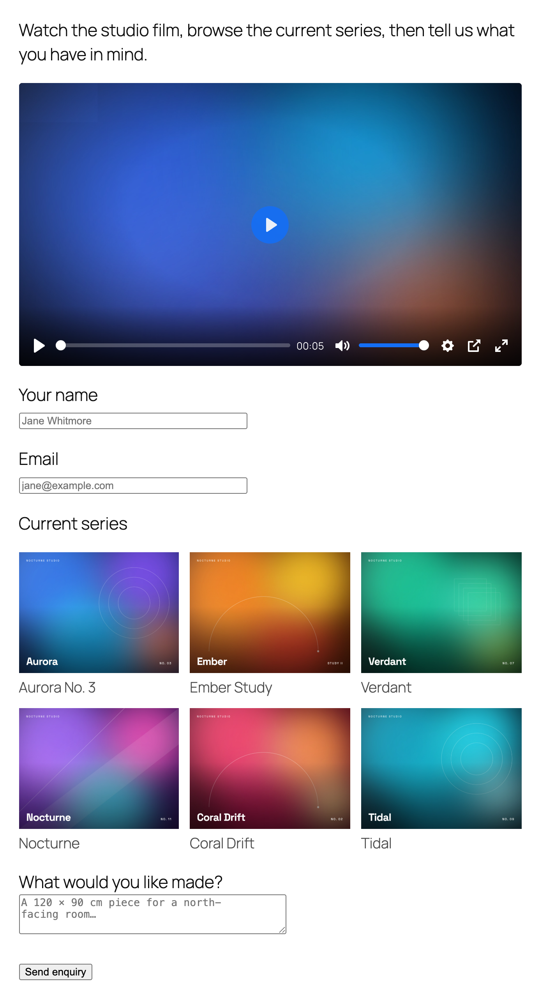

# Media Fields for Contact Form 7 — Documentation

Media Fields adds five media field types to Contact Form 7: **video**, **audio**, **3D models**, **image galleries** and **PDF flipbooks**. Each one is a normal Contact Form 7 form-tag, so you can place a player, a model or a brochure anywhere inside a form, next to the fields people fill in.



## Contents

| Guide | What it covers |
|---|---|
| [1. Getting started](01-getting-started.md) | Install, activate, the one-time opt-in, build your first field, put the form on a page |
| [2. Video field](02-video.md) | Self-hosted MP4/WebM, YouTube and Vimeo, every player option |
| [3. Audio field](03-audio.md) | MP3, M4A, OGG, WAV, FLAC players |
| [4. 3D model field](04-3d-models.md) | glTF/GLB models with orbit, zoom, hotspots and augmented reality |
| [5. Image gallery field](05-gallery.md) | Grid, masonry, justified and carousel layouts with a lightbox |
| [6. PDF flipbook field](06-pdf-flipbook.md) | Page-turning or scrolling PDF viewer |
| [7. Settings](07-settings.md) | Site-wide defaults, enabling and disabling field types, general options |
| [8. FAQ and troubleshooting](08-faq.md) | Common questions and fixes |
| [9. For developers](09-developers.md) | Filters for extending the plugin |

## How the tags work, in one minute

Every media tag follows the same pattern:

```
[video my-video option:value flag "https://example.com/clip.mp4"] Optional title [/video]
 ^     ^        ^             ^    ^                                ^
 type  name     options       flag the media URL(s), always last    shown as the title / alt
```

* **Type** — `video`, `audio`, `3d_models`, `gallery` or `pdf_flipbook`.
* **Name** — any name you like, letters, numbers and dashes. It is required but nothing is submitted with the email, so it never appears in your mail template.
* **Options** — `option:value` pairs and bare `flag` words. Only the options you set are written; everything else uses the defaults from the settings screen.
* **URLs** — in double quotes, **always last**.
* **Title** — optional text between the opening and closing tag. Used as the player title or the alt text.

You do not have to remember any of this. Every field has a **tag generator** button in the form editor that writes the tag for you. See [Getting started](01-getting-started.md).

## Requirements

* WordPress 6.2 or newer
* PHP 7.4 or newer
* Contact Form 7 6.0 or newer (the plugin installs it for you if it is missing)

## Links

* Plugin page: https://wordpress.org/plugins/b-media-fields-for-cf7/
* Live demo: https://media-fields.bplugins.com/
* Support forum: https://wordpress.org/support/plugin/b-media-fields-for-cf7/
* Two-minute introduction: https://youtu.be/sbw-mq7Yugs
* Step-by-step tutorial: https://youtu.be/Xq6rbmm0YbQ
